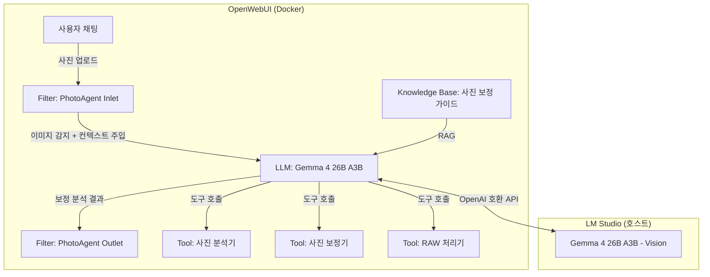
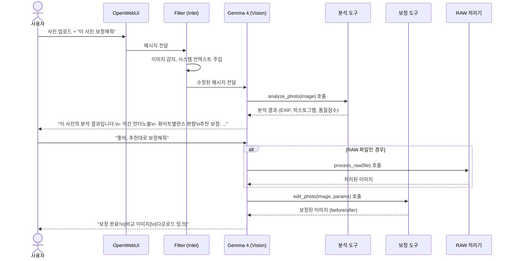

# 📸 OpenWebUI PhotoAgent - 시스템 아키텍처

## 전체 개요

사용자가 OpenWebUI 채팅에서 사진을 업로드하면, AI가 사진을 분석하고 보정 방향을 제안한 뒤, 사용자 확인 후 실제 보정을 실행하는 **대화형 사진 보정 시스템**입니다.

## 시스템 구성 요소

## 컴포넌트 상세

### 1. 🔧 Tool: `photo_analyzer.py` — 사진 분석 도구
- **역할**: 업로드된 이미지의 기술적 메타데이터 분석
- **기능**:
  - EXIF 데이터 추출 (ISO, 셔터속도, 조리개, 화이트밸런스 등)
  - 히스토그램 분석 (노출, 밝기 분포)
  - 색온도/화이트밸런스 평가
  - 노이즈 레벨 추정
  - 전체적 이미지 품질 점수
- **출력**: JSON 형태의 분석 리포트

### 2. 🎨 Tool: `photo_editor.py` — 사진 보정 도구
- **역할**: 실제 이미지 보정 수행
- **기능**:
  - 기본 보정: 노출, 대비, 채도, 선명도, 화이트밸런스
  - 고급 보정: 톤커브, HSL, 비네팅, 노이즈 제거
  - 보정 전/후 비교 이미지 생성
  - 보정 파라미터 JSON 출력
- **출력**: Base64 인코딩된 보정 이미지 + 다운로드 링크

### 3. 📷 Tool: `raw_processor.py` — RAW 파일 처리 도구
- **역할**: Canon CR2, Samsung DNG 등 RAW 파일 처리
- **기능**:
  - RAW 파일 디코딩 (rawpy/LibRaw)
  - 카메라 화이트밸런스 적용
  - 16비트 → 8비트 변환 (톤 매핑)
  - RAW → JPEG/PNG 변환
- **출력**: 처리된 이미지

### 4. 🧠 Filter: `photo_agent_filter.py` — 대화 흐름 제어
- **역할**: 사진 보정 워크플로우의 대화 흐름을 제어
- **Inlet**: 이미지 업로드 감지 시 시스템 프롬프트 + 보정 컨텍스트 주입
- **Outlet**: 보정 결과 포맷팅, 비교 이미지 렌더링

### 5. 📚 Knowledge Base: 사진 보정 가이드
- 사진 보정 기초 이론 (노출, 화이트밸런스, 색 이론)
- 장르별 보정 스타일 가이드 (인물, 풍경, 음식 등)
- Canon 5D / Samsung S26 Ultra 카메라별 특성
- RAW 파일 처리 베스트 프랙티스

### 6. 💬 System Prompt: 사진 보정 에이전트
- 사진 전문가 페르소나
- 단계별 워크플로우 가이드
- 도구 호출 규칙

## 워크플로우

## 기술 스택

| 컴포넌트 | 기술 |
|---------|------|
| LLM | Gemma 4 26B A3B (LM Studio, Vision 지원) |
| 이미지 처리 | Pillow, OpenCV, NumPy |
| RAW 처리 | rawpy (LibRaw 바인딩) |
| EXIF 분석 | piexif, ExifRead |
| 히스토그램 | NumPy, Matplotlib |
| 노이즈 분석 | scikit-image |
| OpenWebUI | 0.6.x (Docker) |
